# The Movie App

A movie app to showcase flutter UI.

## Show some :heart: and star the repo to support the project

## IOS Dark Screenshots
 
 
 
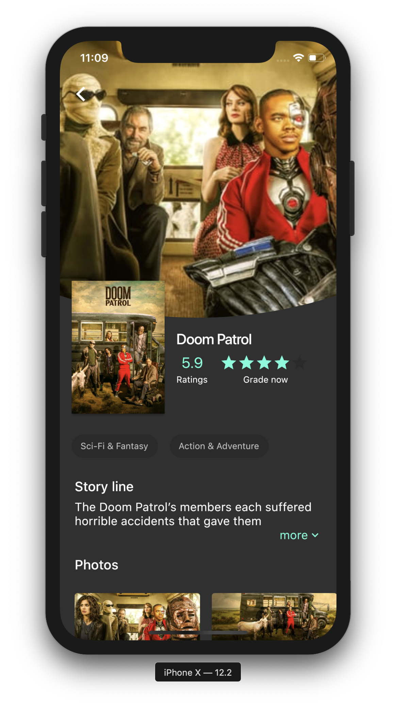 
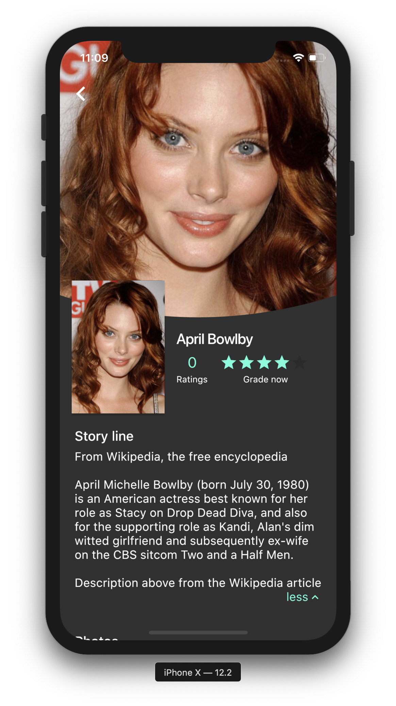 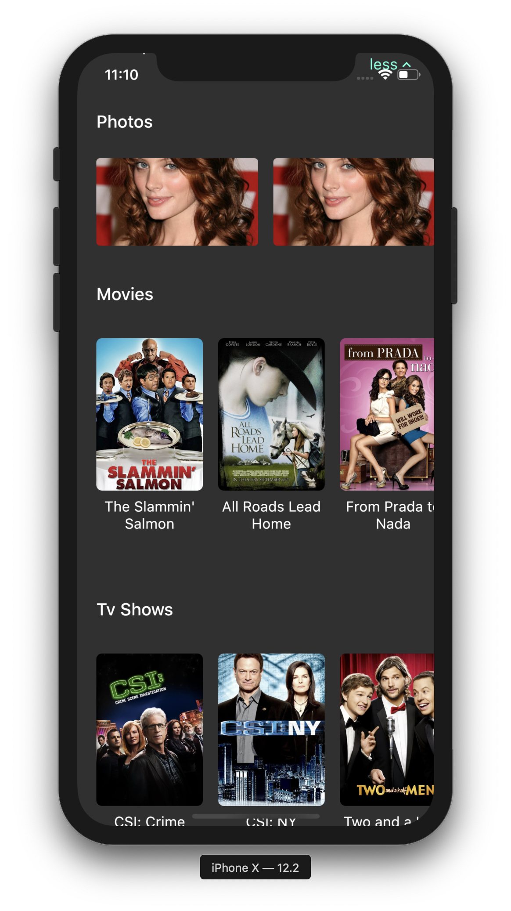
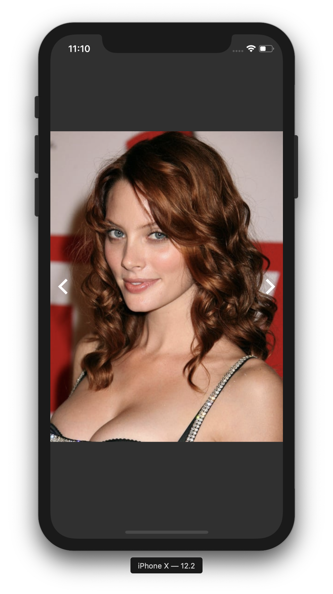 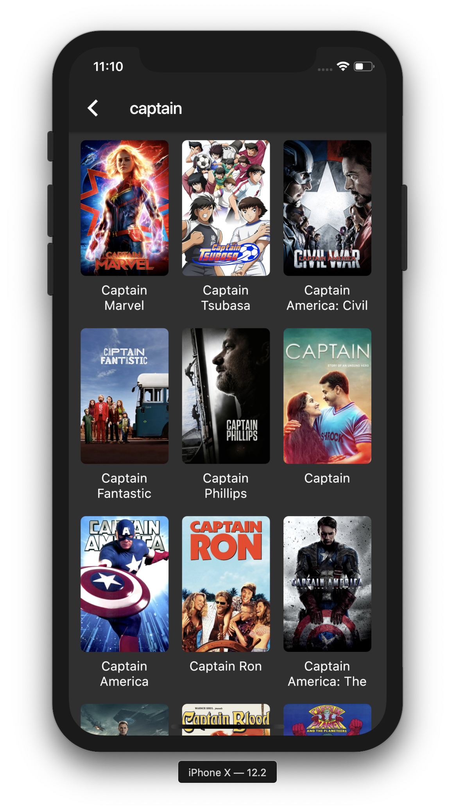

## IOS Light Screenshots
 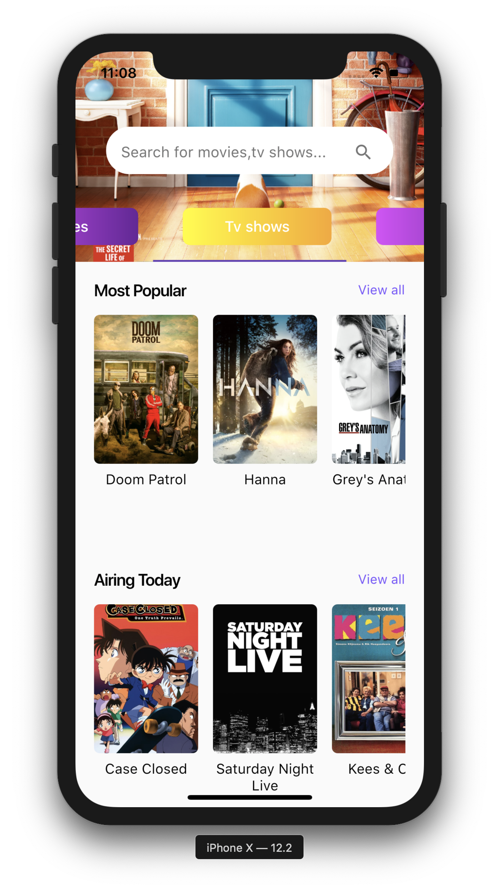
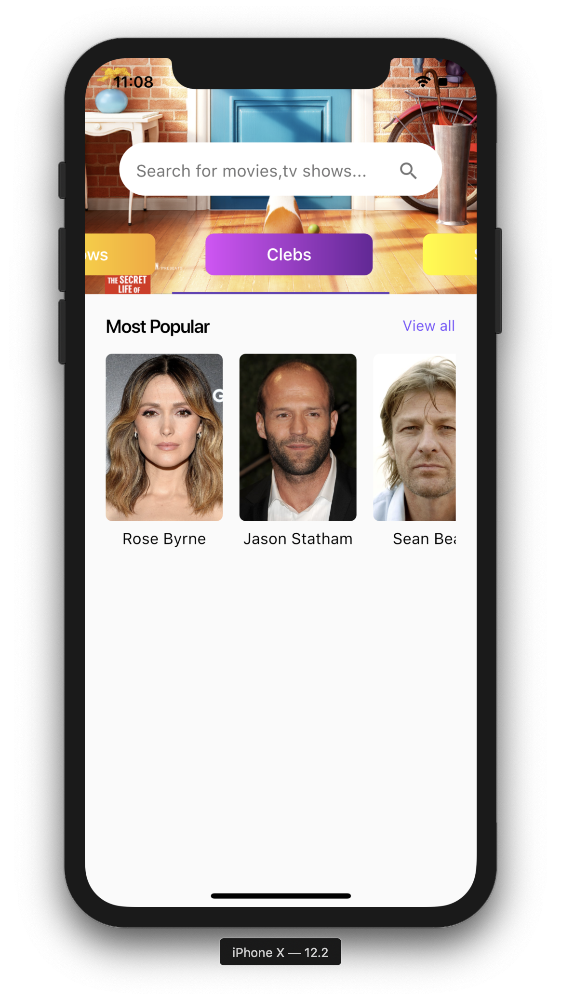 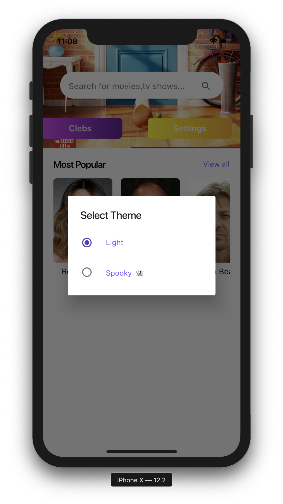
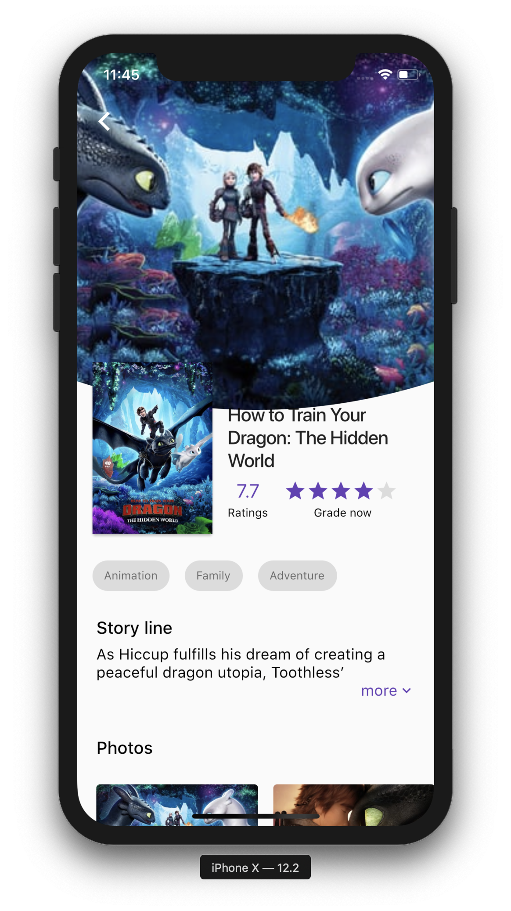 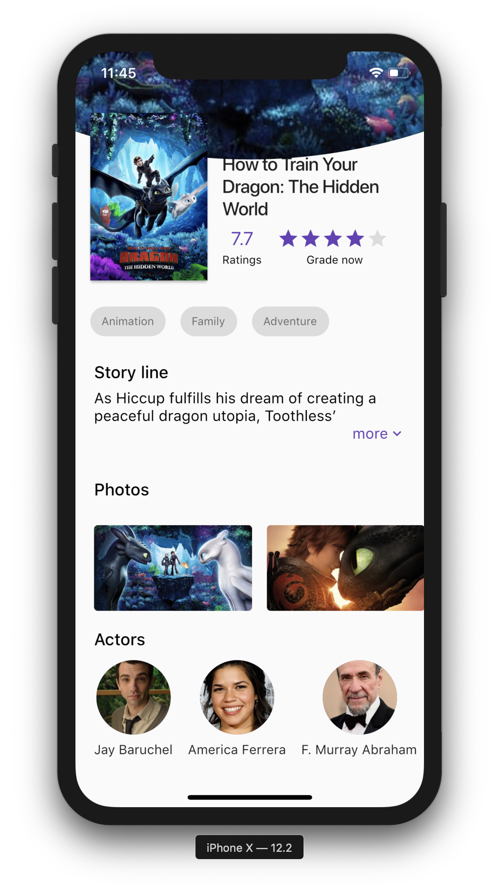
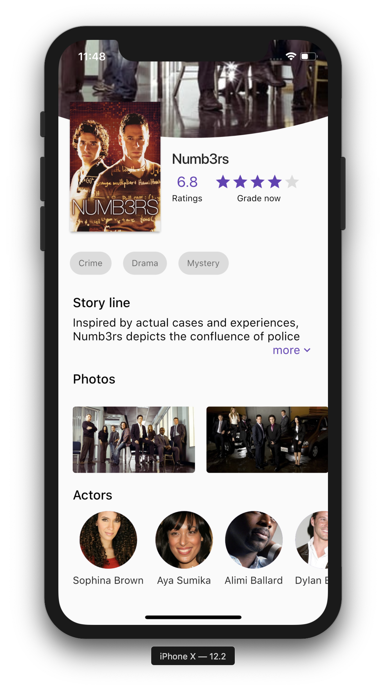 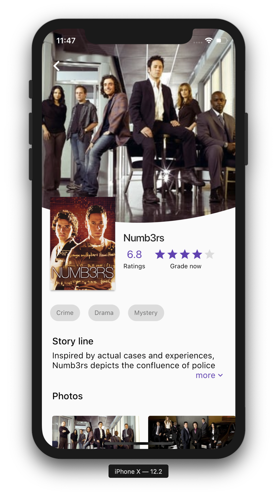
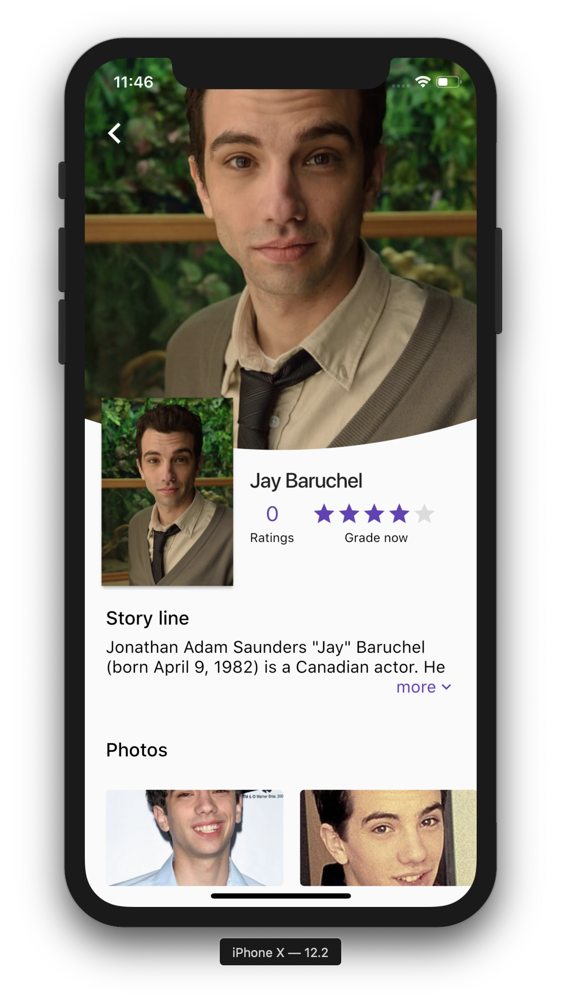 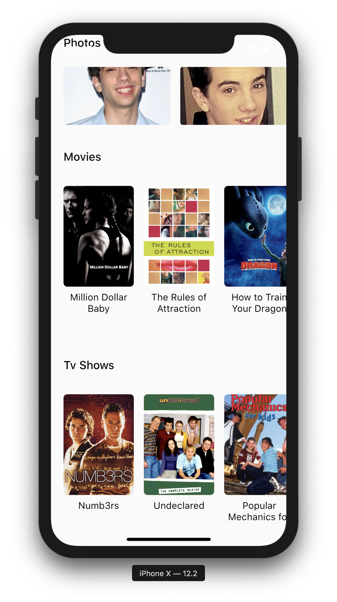
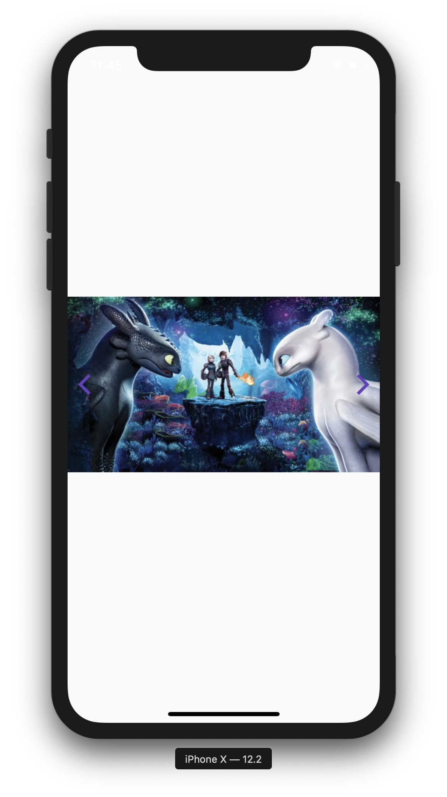 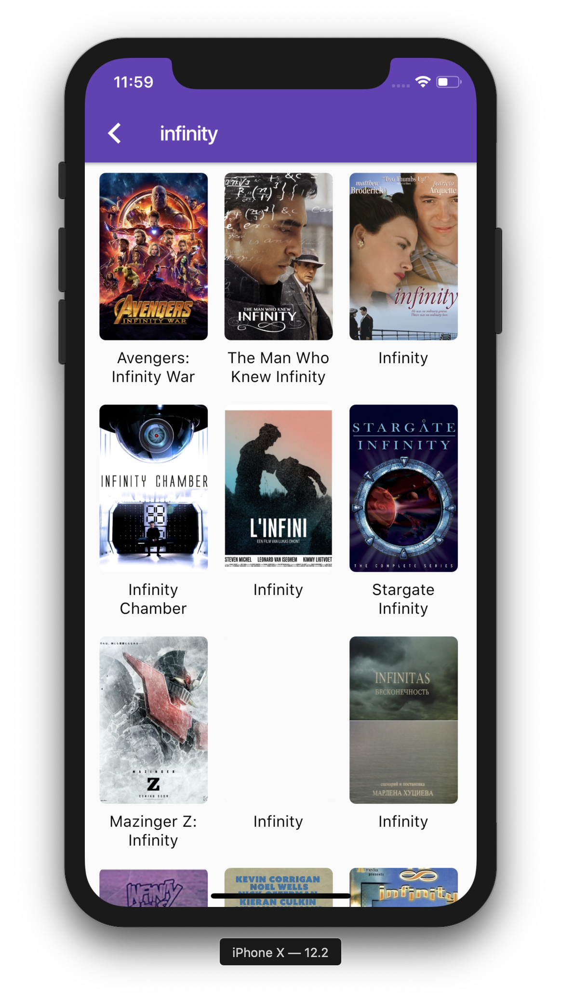

## Created & Maintained By

- Kishan Singh

## Getting Started

**Note:** Make sure your Flutter environment is setup.

### Installation

In the command terminal, run the following commands:

    $ git clone https://github.com/KishanSingh1993/movie_app.git
    $ cd movie_app/
    $ create a api_secret.dart file in utils package and add the TMDB api key
    $ flutter run

## Simulate for iOS
### Method One

    Open the project in Xcode from ios/Runner.xcodeproj.
    Hit the play button.

### Method Two

    Run the following command in your terminal.
    $ open -a Simulator
    $ flutter run

### Simulate for Android

    Make sure you have an Android emulator installed and running.
    Run the following command in your terminal.
    $ flutter run

### Simulate on Android and Ios at the same time

    Make sure you have an Android emulator and IOS simulator is running.
    Run the following command in your terminal.
    $ flutter run -d all

